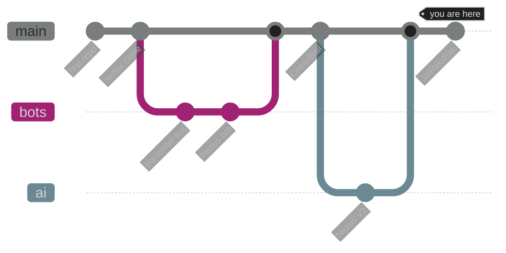
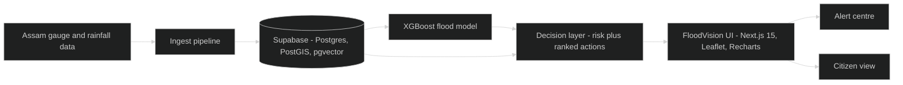
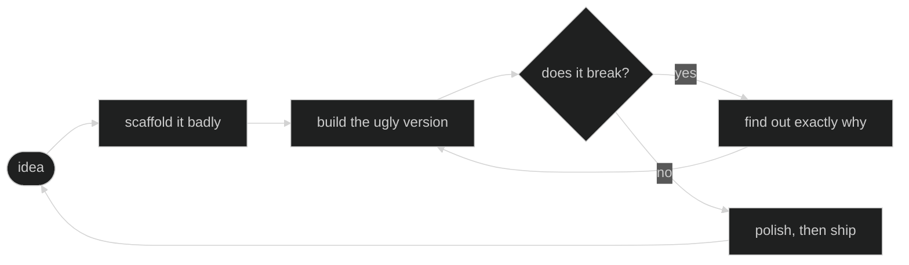

<!--
  ════════════════════════════════════════════════════════════════════════════
  PROFILE README — DebugNova (Kaustab Borah)
  Paste into: github.com/DebugNova/DebugNova/README.md   (this one file, done)
  ════════════════════════════════════════════════════════════════════════════

  LIVE SERVICES USED (all verified responding, Sept 2026)
    capsule-render.vercel.app                banner + footer wave
    readme-typing-svg.demolab.com            animated tagline
    img.shields.io                           badges
    komarev.com                              view counter
    streak-stats.demolab.com                 contribution streak
    github-profile-summary-cards.vercel.app  stats + language charts
    skillicons.dev                           tech icons
    opengraph.githubassets.com                repo cards (GitHub-owned)

  NATIVE, ZERO-DEPENDENCY
    Mermaid diagrams render on GitHub's own servers. They cannot break.

  DEAD — DO NOT ADD BACK (all broken as of Sept 2026)
    github-readme-stats.vercel.app           503 DEPLOYMENT_PAUSED
    github-readme-activity-graph.vercel.app  402 owner billing-locked
    github-profile-trophy.vercel.app         402 owner billing-locked
  Test any new service before trusting it:
    curl -sI "https://service/api?username=DebugNova" | head -1   → want 200

  PALETTE  indigo #6366F1 · violet #A855F7 · cyan #22D3EE · bg #0D1117
  ════════════════════════════════════════════════════════════════════════════
-->


<div align="center">

<a href="https://portfolio-kaustab-borah-1ujf.vercel.app/">
  
</a>

<br />


<a href="https://github.com/DebugNova?tab=repositories"></a>
<a href="https://github.com/DebugNova?tab=followers"></a>
<a href="https://github.com/DebugNova?tab=stars"></a>

<br />

<a href="https://portfolio-kaustab-borah-1ujf.vercel.app/"></a>
<a href="https://www.linkedin.com/in/kaustab-borah-08304a35b/"></a>
<a href="mailto:kaustab.borah44@gmail.com"></a>
<a href="https://www.youtube.com/@novanemesiss"></a>

<br /><br />

<b><a href="#about">About</a></b> &nbsp;•&nbsp;
<b><a href="#stack">Stack</a></b> &nbsp;•&nbsp;
<b><a href="#analytics">Analytics</a></b> &nbsp;•&nbsp;
<b><a href="#architecture">Architecture</a></b> &nbsp;•&nbsp;
<b><a href="#projects">Projects</a></b> &nbsp;•&nbsp;
<b><a href="#arcade">Arcade</a></b> &nbsp;•&nbsp;
<b><a href="#contact">Contact</a></b>

</div>


<a id="about"></a>

## 🧑‍💻 About Me

I'm a self-taught full-stack developer from **Assam, India**. Most of my time goes
into **JalRakshak** — an AI water-intelligence platform for flood prediction in the
Brahmaputra floodplain, built for IIT Guwahati TIC × Bharat WIN. I like carrying an
idea all the way from an empty repo to something deployed that people actually use.

```ts
const debugNova = {
  name:     "Kaustab Borah",
  alias:    "DebugNova",
  location: "Assam, India 🇮🇳",
  role:     "Full-Stack Developer",
  building: ["JalRakshak", "Nexus"],
  learning: ["System Design", "Backend at scale", "Cloud & DevOps", "ML"],
  motto:    "Build. Break. Debug. Ship. Repeat.",
} as const;
```

|  |  |
| :-- | :-- |
| 🔭 **Building** | [JalRakshak](https://github.com/DebugNova/JalRakshak) — flood prediction on Next.js 15 + Supabase/PostGIS + XGBoost |
| ⚡ **Also building** | [Nexus](https://github.com/DebugNova/Nexus-V3) — my AI assistant, now on its third iteration |
| 🌱 **Learning** | System design, backend architecture, cloud & DevOps, machine learning |
| 👯 **Open to** | AI tooling, developer products, climate tech |
| 💬 **Ask me about** | Next.js, TypeScript, Supabase, shipping side projects solo |
| 📫 **Reach me** | [kaustab.borah44@gmail.com](mailto:kaustab.borah44@gmail.com) |


<a id="stack"></a>

## 🛠️ Tech Stack

<div align="center">

<sub><b>LANGUAGES</b></sub><br />


<sub><b>FRONTEND</b></sub><br />


<sub><b>BACKEND &amp; DATA</b></sub><br />


<sub><b>TOOLING &amp; CLOUD</b></sub><br />


<sub><b>AI / ML</b></sub><br />


</div>


<a id="analytics"></a>

## 📊 GitHub Analytics

<div align="center">


<br /><br />


<br />


<br /><br />


</div>

### 🌿 How I got here

<!-- Mermaid renders on GitHub's own servers — no external service, never breaks. -->




<a id="architecture"></a>

## 🌊 Inside JalRakshak

A real look at what I'm building — flood risk for the Brahmaputra floodplain,
end to end.



> **Held-out model AUC: 0.895** against a naive baseline of 0.942 on the easier
> split. Outputs are advisory decision support — they augment CWC, IMD and Google
> Flood Hub, never replace them.

### ⚙️ And how I work on anything




<a id="projects"></a>

## 🚀 Featured Projects

<div align="center">

<a href="https://github.com/DebugNova/JalRakshak"></a>
<a href="https://github.com/DebugNova/Nexus-V3"></a>
<a href="https://github.com/DebugNova/ChessBall"></a>
<a href="https://github.com/DebugNova/Nexus-DiscordBot"></a>

</div>

<table>
<tr><th align="left">Project</th><th align="left">What it does</th><th align="left">Stack</th></tr>
<tr>
  <td><b><a href="https://github.com/DebugNova/JalRakshak">🌊 JalRakshak</a></b></td>
  <td>AI water-intelligence platform for Assam. Flood-risk maps, ranked response actions, an alert centre and a citizen view, driven by a validated XGBoost model.</td>
  <td><code>Next.js 15</code> <code>TypeScript</code> <code>Supabase</code> <code>PostGIS</code> <code>Leaflet</code> <code>XGBoost</code></td>
</tr>
<tr>
  <td><b><a href="https://github.com/DebugNova/Nexus-V3">⚡ Nexus V3</a></b></td>
  <td>Third iteration of my AI assistant — a conversational interface with tool use.</td>
  <td><code>JavaScript</code> <code>Node.js</code> <code>LLM APIs</code></td>
</tr>
<tr>
  <td><b><a href="https://github.com/DebugNova/ChessBall">♟️ ChessBall</a></b></td>
  <td>An original game mixing chess movement rules with football objectives.</td>
  <td><code>TypeScript</code> <code>Game Logic</code></td>
</tr>
<tr>
  <td><b><a href="https://github.com/DebugNova/Nexus-DiscordBot">🤖 Nexus Bot</a></b></td>
  <td>An AI bot that servers can actually talk to, built on the Nexus core.</td>
  <td><code>Discord API</code> <code>Node.js</code></td>
</tr>
</table>

<div align="right"><sub><a href="https://github.com/DebugNova?tab=repositories">→ browse all my repositories</a></sub></div>


<a id="arcade"></a>

## 🕹️ The Arcade

Three things to click. No JavaScript, no external service — just markdown doing
more than it's supposed to.

<details>
<summary><b>♟️ Play a move of ChessBall</b></summary>

<br />

The ball is a piece. The goal is a square. Everything else moves like chess.

```
      ┌───┬───┬───┬───┬───┬───┬───┬───┐
    8 │ ♜ │   │   │ ⬛│ ⬛│   │   │ ♜ │   ⬛ = your goal squares
      ├───┼───┼───┼───┼───┼───┼───┼───┤
    7 │   │   │ ♟ │   │   │ ♟ │   │   │
      ├───┼───┼───┼───┼───┼───┼───┼───┤
    6 │   │   │   │ ● │   │   │   │   │   ● = the ball
      ├───┼───┼───┼───┼───┼───┼───┼───┤
    5 │   │   │   │   │   │   │   │   │
      ├───┼───┼───┼───┼───┼───┼───┼───┤
    4 │   │   │   │   │ ♖ │   │   │   │   ♖ = your rook
      └───┴───┴───┴───┴───┴───┴───┴───┘
        a   b   c   d   e   f   g   h
```

Your rook is on **e4**. The ball is on **d6**. Rooks move in straight lines, and
moving onto the ball pushes it one square further along the same line.

<details>
<summary>Which single move puts the ball on a goal square?</summary>

<br />

**Re4 → e6 doesn't touch it.** The answer is to get onto the ball's rank or file
first: **Re4–e6**, then **Re6–d6** pushes the ball from d6 to **c6**. Two moves,
not one — there is no one-move solution from here, and finding that out is the
actual puzzle.

That's the design problem the whole repo is about: chess pieces are *bad* at
pushing things, which makes the football part interesting.

</details>
</details>

<details>
<summary><b>🐛 Find the bug</b> — real one, from my own commit history</summary>

<br />

```ts
async function getFloodRisk(districts: string[]) {
  const results = [];
  districts.forEach(async (d) => {
    const risk = await model.predict(d);
    results.push({ district: d, risk });
  });
  return results;
}
```

<details>
<summary>Show the answer</summary>

<br />

`forEach` doesn't await anything. It fires all the callbacks, returns
immediately, and `results` is still empty when the function returns. The `async`
on the inner arrow makes it *look* handled, which is why this one survives code
review.

```ts
async function getFloodRisk(districts: string[]) {
  return Promise.all(
    districts.map(async (d) => ({
      district: d,
      risk: await model.predict(d),
    })),
  );
}
```

`Promise.all` + `map` also gets you concurrency for free, which `for...of` with
`await` would have cost you.

</details>
</details>

<details>
<summary><b>🌊 Choose your own flood response</b></summary>

<br />

The model says **78% flood probability** in your district within 48 hours.
Confidence is moderate. You have one decision.

<details>
<summary>→ Issue a public evacuation alert immediately</summary>

<br />

Fast, and it saves lives if you're right. If you're wrong, you've spent public
trust — and the next alert gets ignored. This is why JalRakshak ranks *actions*
rather than just showing a risk number: an alert is a different decision from
pre-positioning a boat.

</details>

<details>
<summary>→ Wait 12 hours for more gauge data</summary>

<br />

Confidence goes up, lead time goes down. In the Brahmaputra floodplain, 12 hours
can be the entire warning window. Sometimes the correct move is the one you make
with worse information.

</details>

<details>
<summary>→ Quietly pre-position resources and hold the alert</summary>

<br />

Usually the best answer, and the one that doesn't fit in a dashboard's red/green
badge. It's also the hardest to build a UI for, which is most of what I've been
working on.

</details>
</details>


## 🧠 What I'm Working Through

```text
TypeScript / Next.js   ████████████████████░   shipping daily
Node.js & APIs         ██████████████████░░░   building
Supabase / Postgres    █████████████████░░░░   building
System Design          ███████████████░░░░░░   learning
Cloud & DevOps         █████████████░░░░░░░░   learning
Machine Learning       ████████████░░░░░░░░░   exploring
```

<details>
<summary><b>🐍 Want the snake animation eating your commits?</b></summary>

<br />

It can't live in this file — it needs a generated SVG. Add
`.github/workflows/snake.yml` to this repo with the contents below, set
`Settings → Actions → General → Workflow permissions` to **Read and write**,
then run it once from the Actions tab.

```yaml
name: Snake Animation
on:
  schedule: [{ cron: "17 2 * * *" }]
  workflow_dispatch:
permissions:
  contents: write
jobs:
  snake:
    runs-on: ubuntu-latest
    steps:
      - uses: actions/checkout@v4
      - uses: Platane/snk/svg-only@v3
        with:
          github_user_name: ${{ github.repository_owner }}
          outputs: assets/snake.svg?palette=github-dark&color_snake=#6366F1
        env:
          GITHUB_TOKEN: ${{ secrets.GITHUB_TOKEN }}
      - run: |
          git config user.name github-actions
          git config user.email github-actions@github.com
          git add assets/snake.svg
          git diff --quiet --cached || { git commit -m "snake [skip ci]"; git push; }
```

Then add this line wherever you want it:

```md

```

</details>


<a id="contact"></a>

<div align="center">

### Let's build something

<a href="https://portfolio-kaustab-borah-1ujf.vercel.app/"></a>
<a href="mailto:kaustab.borah44@gmail.com"></a>
<a href="https://www.linkedin.com/in/kaustab-borah-08304a35b/"></a>

<sub>If something here is useful, a ⭐ costs you nothing and means a lot.</sub>

</div>


